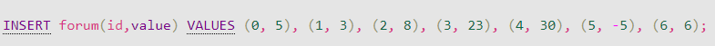
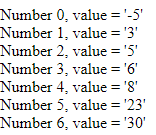
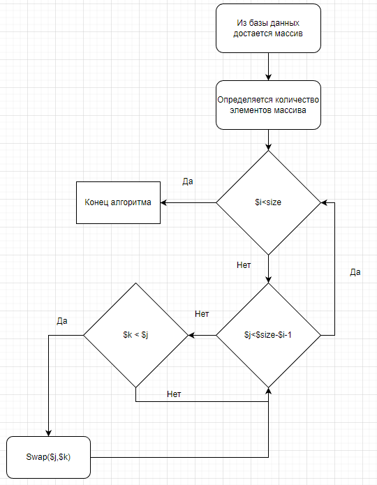

# ОТЧЁТ О ЛАБОРАТОРНОЙ РАБОТЕ №5
#### *По курсу "Основы Программирования"*
#### *Работу выполнил студент группы №3131 Беляев Д.Н.*
#### [Ссылка на GitHub](https://github.com/FireIceMage/Lab5.git)

## Цель работы:
Разработать алгоритм внешней сортировки. Данные хранятся на сервере в массиве, сервер предоставляет доступ к отдельным элементам. Клиент поочередно запрашивая отдельные ячейки сортирует массив.

## Ход работы
### Пользовательский интерфейс
1. Заполнение массива                        
   
2. Отсортированный массив                                             
   

### Пользовательский сценарий
Пользователь вводит массив в базу даных, после обновляет страницу index.php и получает осортированный массив.

## Описание структуры базы данных
Браузерное приложение phpMyAdmin используется для просмотра содержимого базы данных. Всего 2 столбцов:
1. "id" типа int для выдачи уникальных id всем сообщениям
2. "value" типа int для хранения содержимого ячеек массива

## Описание алгоритмов
* Алгоритм сортировки пузырьком                                        


## Значимые фрагменты кода
* Функция сортировки пузырьком
```
function bubbleSort() {
    require("connection.php");
    $result = mysqli_query($con, "SELECT DISTINCT * FROM forum");
    $size = mysqli_num_rows($result);
    for ($i=0; $i<$size; $i++) {
        for ($j=0; $j<$size-$i-1; $j++) {
            $k = $j+1;
            if (getValue($k) < getValue($j)) {
                $temp = getValue($k);
                setValue($k, getValue($j));
                setValue($j, $temp);
            }
        }
    }
    for ($i=0; $i<$size; $i++) {
        echo("Number $i, value = '".getValue($i)."'");
        echo "<br>";
    }
}
```